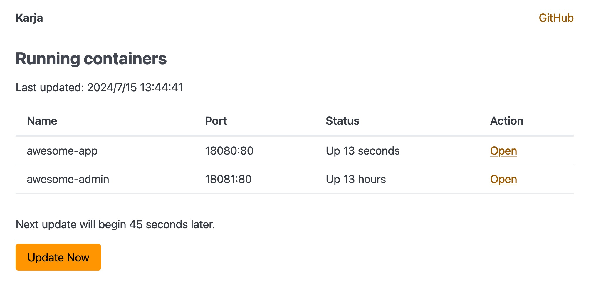

# Karja

Karja is a reverse proxy to Docker containers for local development.

## Screenshot



## Features

- **Reverse Proxy:** Act as a HTTP reverse proxy to containers in your Docker
- **Dashboard:** Display running Docker containers
- **One binary:** Work with just one binary file

## Tech Stack

- [Golang](https://go.dev/)
- [Docker Engine Go SDK](https://docs.docker.com/engine/api/sdk/)
- [Svelte](https://svelte.dev/)
- [milligram](https://milligram.io/)

## Usage

There are two ways to run Karja: as a Docker container or outside of Docker.

### 1. As a Docker container

Don't forget to mount `docker.sock` to call Docker API from Karja.

```bash
docker run -d --name karja -v /var/run/docker.sock:/var/run/docker.sock -p 80:9000 mtgto/karja
```

Open http://localhost

### 2. Outside of Docker

```bash
go build
PORT=80 ./karja
```

Open http://localhost

## Development

Karja consists of a frontend with Svelte and a backend with Golang.
Before you develop backend, you should build web assets.
`go build` embed web assets automatically.

```bash
cd web
pnpm install
pnpm build

cd ..
go build
./karja
```

## Related projects

- [yaichi](https://github.com/mtsmfm/yaichi) It has almost the same purpose and uses [ngx_mruby](https://ngx.mruby.org/). It supports containers that don't publish port(s)

## License

Apache 2.0
